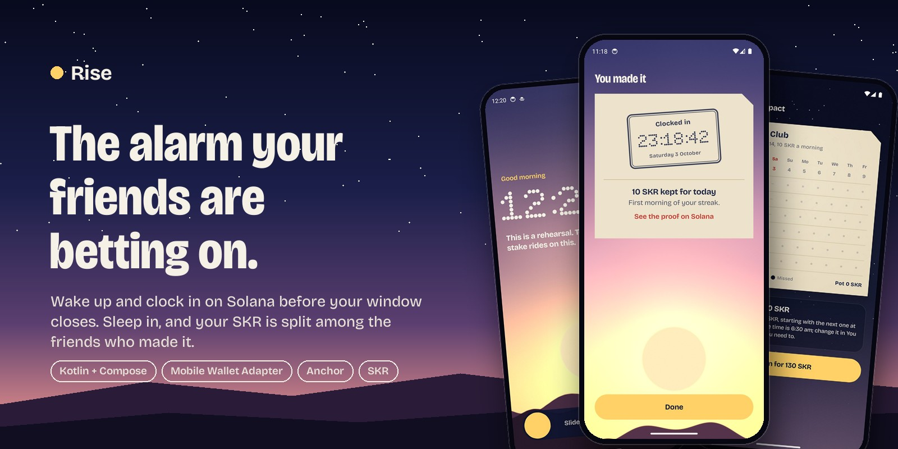
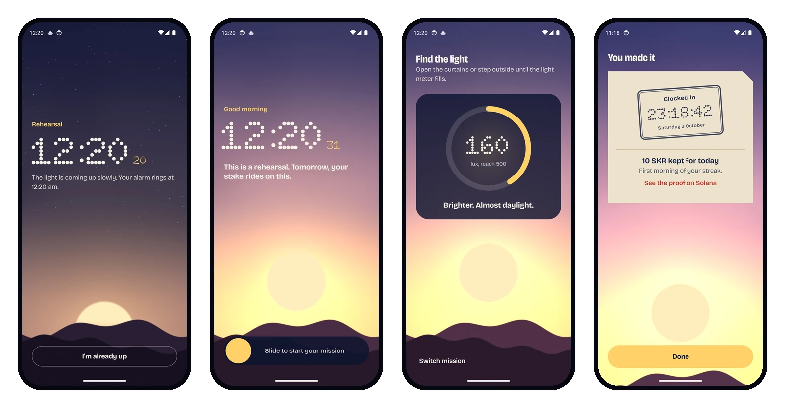
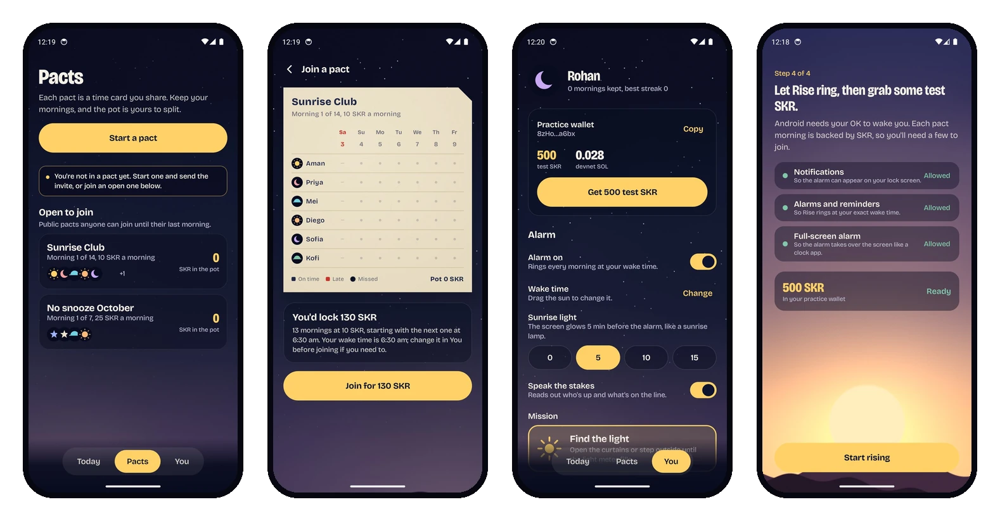
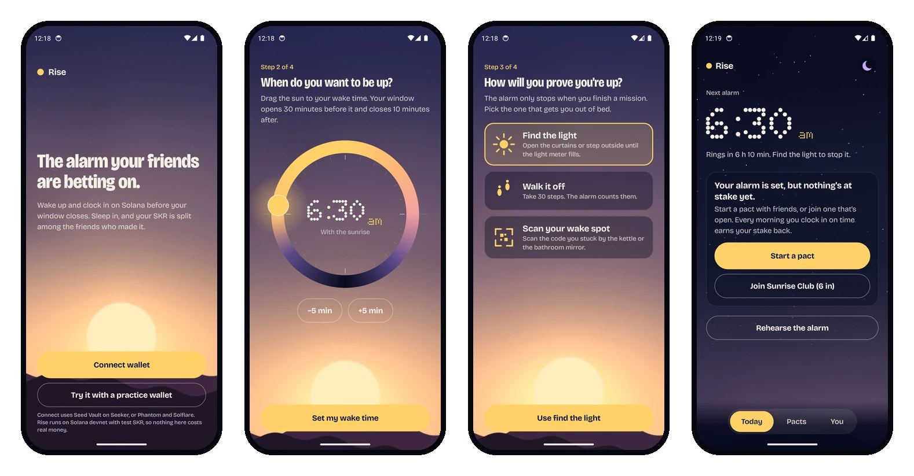
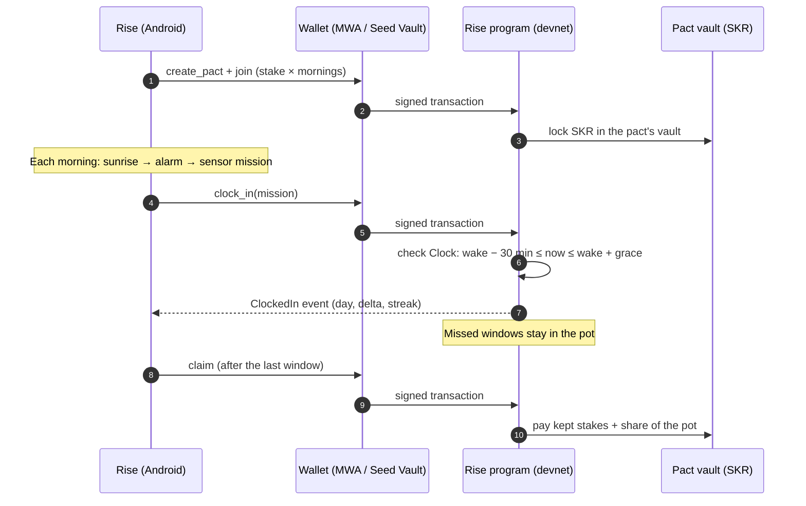
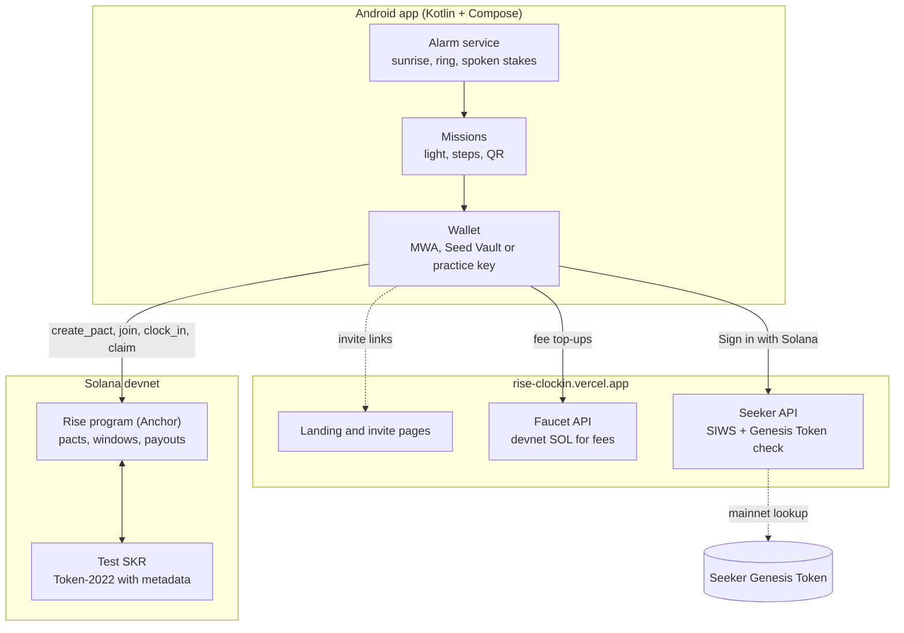

<div align="center">



<br>

[](https://github.com/RohanGlitched/rise-clockin/actions/workflows/ci.yml)
[](https://explorer.solana.com/address/6kQL7PccHpE7yUrsq5TgxFgQc7K7FVbUJShRUPbWfCdS?cluster=devnet)
[](https://www.anchor-lang.com/)
[](https://rise-clockin.vercel.app/rise.apk)
[](android/)
[](LICENSE)

**[Download the APK](https://rise-clockin.vercel.app/rise.apk)** · **[Website & live pacts](https://rise-clockin.vercel.app)** · **[Program on Explorer](https://explorer.solana.com/address/6kQL7PccHpE7yUrsq5TgxFgQc7K7FVbUJShRUPbWfCdS?cluster=devnet)**

</div>

---

**Rise is an alarm clock with something on the line.** Friends form a pact and lock SKR for every morning of it. Each morning, the alarm only stops when you finish a real-world mission (find daylight, walk 30 steps, or scan the code taped by your kettle), and then you clock in on Solana before your wake window closes. Sleep in, and that morning's stake goes into the pot, which is split among the friends who made it.

Snooze buttons win because nothing is at stake. Rise turns waking up into a daily, social, on-chain habit, built natively for the Solana Seeker.

<br>

## A morning with Rise



| | |
|---|---|
| **1 · Sunrise** | Minutes before your wake time the alarm takes over the lock screen and the screen warms and brightens like a sunrise lamp. The sky is a real-time GPU shader that moves from night to dawn. |
| **2 · The stakes, out loud** | At your wake time the alarm climbs from a gentle chime to full volume and *speaks*: "Good morning, Rohan. It's 6:30. Aman and Priya are already up. 10 SKR is on the line." |
| **3 · Prove you're up** | Slide the sun to start your mission. The phone's own sensors decide when you're done: the ambient light sensor must read daylight, the step detector must count 30 steps, or the camera must scan your wake-spot code (on-device ML Kit). |
| **4 · Clock in** | One signature through Mobile Wallet Adapter. The Rise program checks Solana's clock: a clock-in counts only between 30 minutes before your wake time and the end of the grace period. |
| **5 · The stamp** | Your time is punched onto the pact's manila time card with a heavy haptic thump: blue-black ink when on time, red when late. Missed mornings are punched clean through the card. |

<br>

## Pacts, invites and your profile



- **Start a pact** with a name, a stake per morning and a length (3–30 mornings). It's created and joined in one transaction.
- **Invite** with a QR code or a link (`rise-clockin.vercel.app/join/<pact>`). The link opens the app, or a web page that renders the pact's live time card straight from devnet.
- **Join late** and lock stakes only for the mornings left.
- **Collect** your payout when the pact ends: your kept stakes plus your share of the pot.

<br>

## Setting up takes a minute



Connect a wallet (Seed Vault on Seeker, Phantom, Solflare) or try it instantly with a built-in practice wallet. Pick a name and a sign, drag the sun around a 24-hour sky to set your wake time, choose a mission, and grab test SKR with one tap. Devnet SOL for fees is topped up automatically.

<br>

## How it works



### The pot

Every member locks `stake × mornings`. A morning you keep earns your stake back; a missed one stays in the pot. When the pact ends:

```
pot       = total deposited − stake × (mornings kept by everyone)
payout_i  = stake × kept_i  +  pot × kept_i ÷ (mornings kept by everyone)
```

Payouts always sum to exactly what was deposited, so the vault can pay every claim. If nobody wakes up at all, everyone gets their deposit back. There is no admin key, no fee and no way for anyone (including us) to move SKR out of a pact.

<br>

## Built for Seeker

| | |
|---|---|
| **Mobile Wallet Adapter** | All signing goes through MWA 2.0, so Seed Vault on Seeker (or Phantom / Solflare) holds the keys. |
| **Seeker Genesis Token** | Sign in with Solana, then the Rise server verifies the signature and checks the wallet for an SGT on mainnet (mint authority, metadata pointer and group membership must all match). Verified owners get a badge. |
| **SKR, not staking** | SKR is the stake and the reward of every pact. It moves between friends based on who gets up, which is a reason to hold and use SKR every day. |
| **Phone hardware as proof** | Ambient light sensor, step detector, camera with on-device QR scanning, exact alarms, lock-screen full-screen intents, haptics and text-to-speech. None of this works in a browser. |

<br>

## Architecture



<br>

## Tech stack

| Layer | Built with |
|---|---|
| Solana program | Rust, Anchor 0.31, Token-2022 (`token_interface`), deployed on devnet |
| Tests | TypeScript, Mocha, Bankrun with a controllable clock |
| Android | Kotlin 2.2, Jetpack Compose, AGSL runtime shaders, CameraX, ML Kit barcode scanning, AlarmManager, TextToSpeech |
| Solana on Android | Mobile Wallet Adapter clientlib-ktx 2.0, sol4k, a small JSON-RPC client |
| Web | Static site + Vercel serverless functions, `@solana/web3.js`, `@solana/spl-token`, tweetnacl |
| Design | Bricolage Grotesque for UI, Doto (dot-matrix) for every clock reading, a palette drawn from the dawn sky and manila time cards |

<br>

## Program reference

| Account | Seeds | Holds |
|---|---|---|
| `Pact` | `"pact", creator, seed` | name, stake per morning, start, day length, mornings, grace, member count, totals |
| `Member` | `"member", pact, owner` | name, sign, wake offset, first morning, deposit, streaks, one clock-in record per morning |
| Vault | ATA of the pact PDA | the locked SKR |
| `Faucet` / `DripTicket` | `"faucet"` / `"drip", user` | test-SKR faucet, one drip per wallet per hour |

| Instruction | What it does |
|---|---|
| `create_pact` | Validates the settings and opens a pact with its vault |
| `join` | Locks the stake for the remaining mornings and records the member's wake time |
| `clock_in` | Records today's clock-in if `now` is inside the member's window; updates streaks |
| `claim` | After the last window closes, pays kept stakes plus the pot share |
| `drip` | Mints 500 test SKR (devnet only), rate-limited per wallet |

Deployed addresses (devnet):

- Program: [`6kQL7PccHpE7yUrsq5TgxFgQc7K7FVbUJShRUPbWfCdS`](https://explorer.solana.com/address/6kQL7PccHpE7yUrsq5TgxFgQc7K7FVbUJShRUPbWfCdS?cluster=devnet)
- Test SKR: [`SKRxp6EbHDAzboW6GvwhL8ARHDU5pQLmtZEh7t4XX38`](https://explorer.solana.com/address/SKRxp6EbHDAzboW6GvwhL8ARHDU5pQLmtZEh7t4XX38?cluster=devnet)
- Public pact "Sunrise Club": [`6mKwohdjprE3F8Ujxz24AtfJv9Q6G9xCdAMR2SLgKhRK`](https://rise-clockin.vercel.app/join/6mKwohdjprE3F8Ujxz24AtfJv9Q6G9xCdAMR2SLgKhRK)

<br>

## Run it yourself

**Try the app.** Install the [APK](https://rise-clockin.vercel.app/rise.apk) on any Android 9+ phone, choose *Try it with a practice wallet*, and tap *Get 500 test SKR*. Rehearse the alarm from the Today screen to see the whole morning in 15 seconds.

**Build the program** (Linux or WSL, Solana CLI 4.x, Anchor 0.31):

```bash
anchor build
npm ci
npm test            # 6 tests: faucet, validation, a full pact, late join, refunds, auth
```

**Build the app** (JDK 21, Android SDK):

```bash
cd android
./gradlew :app:assembleDebug
# point a debug build at a local validator instead of devnet:
./gradlew :app:assembleDebug -Prpc=http://10.0.2.2:8899
```

**Local end-to-end** with a validator and fast 10-minute "days":

```bash
bash scripts/localnet.sh &      # validator with the program preloaded
bash scripts/local-setup.sh     # test SKR, faucet, a demo pact
bash scripts/local-bots.sh      # early risers clocking in on their own habits
```

<br>

## Repository layout

```
programs/rise/      Anchor program: pacts, wake windows, clock-in, payouts, test-SKR faucet
tests/              Bankrun tests with a controllable clock
android/            Kotlin + Compose app (alarm service, missions, MWA wallet, time cards)
web/                Landing page, invite pages, /api/sol faucet, /api/seeker verification
scripts/            Devnet setup, seeding, and the early risers who keep public pacts alive
assets-src/         Generators for the alarm sounds, icons and these README images
docs/               Screenshots and README artwork
```

<br>

## Testing

The program is tested end to end on Bankrun, moving the clock through whole pacts:

- the faucet drips once per hour per wallet
- invalid settings are rejected (length, grace, start time)
- a 3-member, 3-morning pact: early, late and missed clock-ins, windows that haven't opened or have closed, double clock-ins, streaks, and exact payouts that drain the vault to zero
- late joiners lock stakes only for the mornings left, and a joiner whose window hasn't opened yet still counts today
- everyone is refunded when nobody wakes up
- nobody can clock in for someone else

CI runs these tests, builds and lints the Android app, and checks the web API on every push.

<br>

## Honest limits

Rise proves *when* you clocked in on chain; the mission proves *that* you got up on the device. A determined cheat could fake sensor readings on a rooted phone. Pacts are with friends, so the social layer does the rest, and the time card makes every morning visible to everyone in the pact. Rise currently runs on devnet with test SKR.

<br>

<div align="center">
<sub>Made for the Solana Mobile <b>Clock In</b> hackathon · MIT licensed</sub>
</div>
